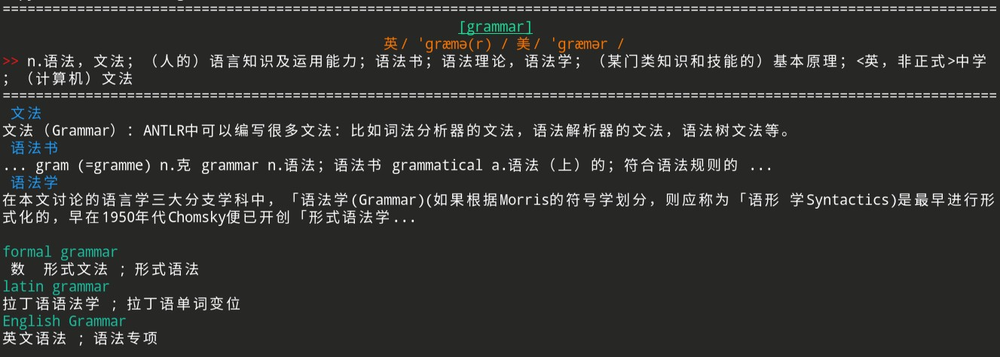
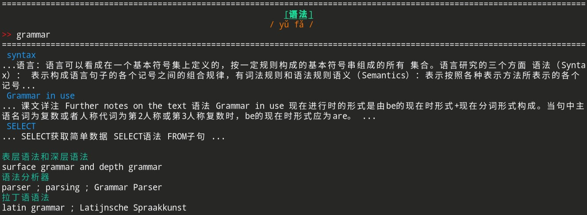
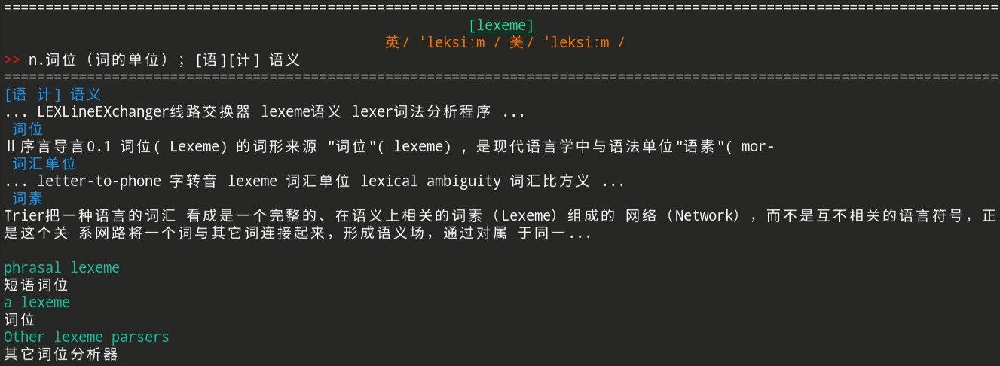

# Neko Dictionary
Neko Dictionary 是一款轻量级命令行中英文词典。

## 安装
```bash
pip install nekodict
```

## 使用
`ndic <word>` 直接查询单词，或 `ndic` 进入交互模式查询单词。

直接查询单词例如:
```bash
ndic grammar
```


进入交互模式查询单词例如:
```bash
ndic
```


在交互模式下输入`q`退出

支持模糊搜索，选取最接近的词条:
```bash
ndic lexem
```



## 其它
本程序基于 [GPLv3](LICENSE) 分发

本程序词典源来自[有道词典](https://dict.youdao.com)

本程序模仿了 [termdic](https://github.com/hzwer/termdic)

建议使用 [yakuake](https://apps.kde.org/yakuake/) 启动 Neko Dictionary